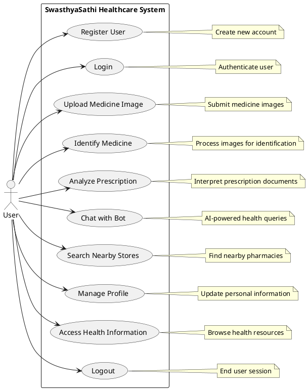
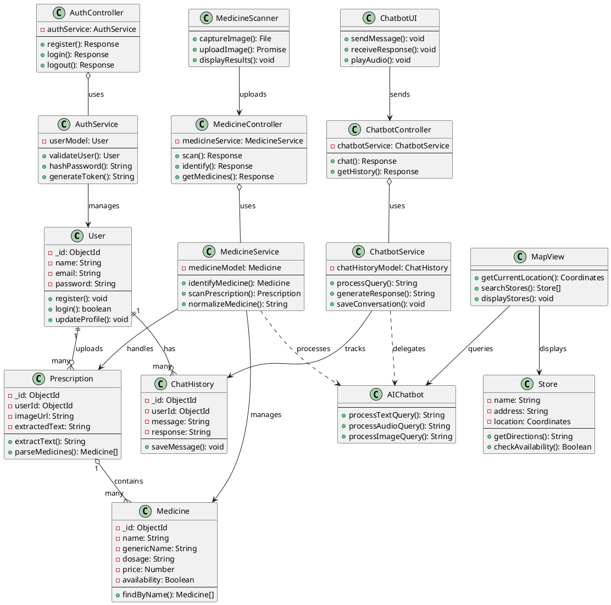
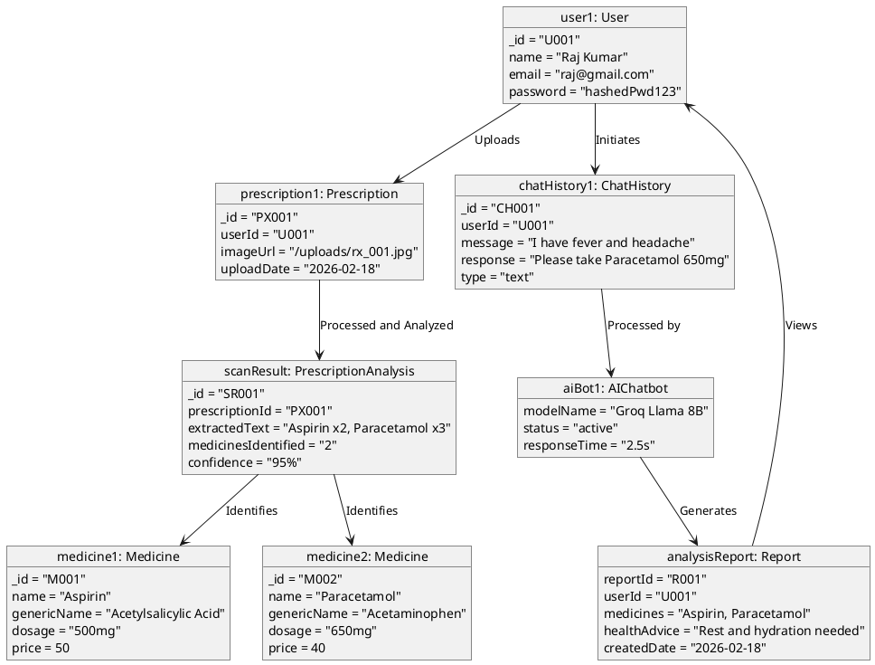
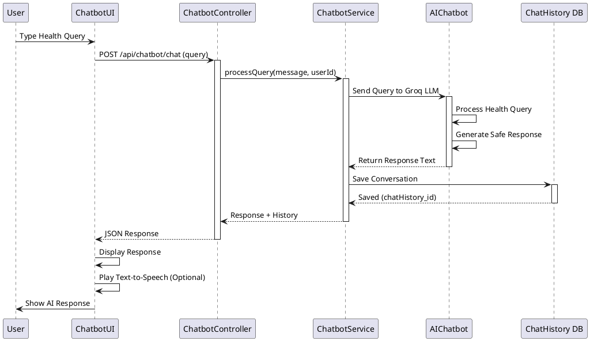
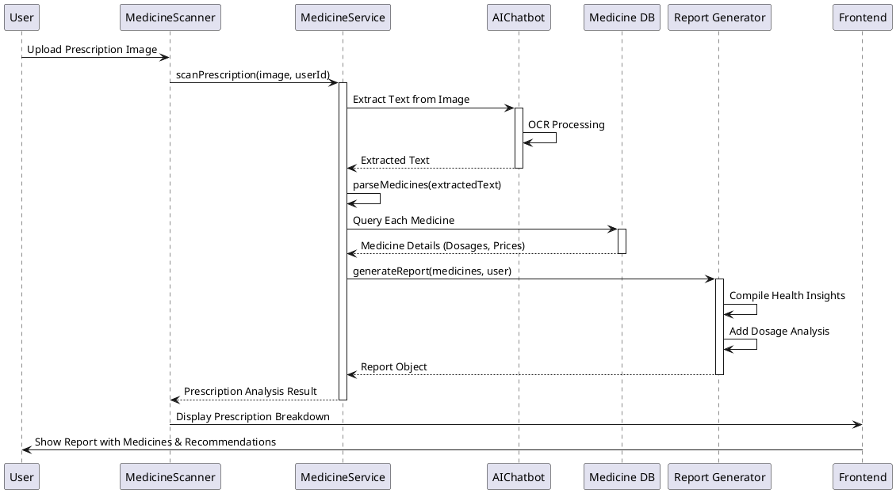
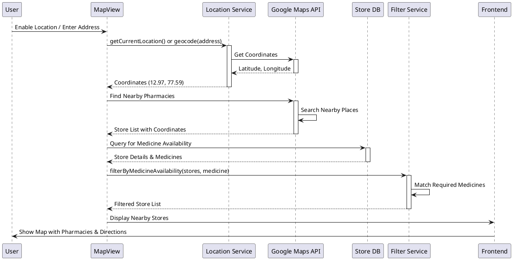
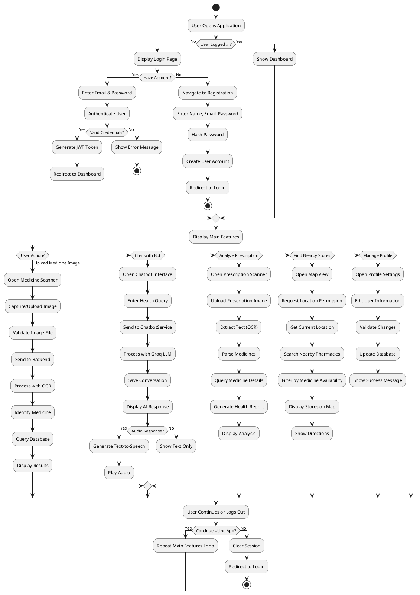

# Swasthya Sathi - System Design Document

## 1. Overview

**Swasthya Sathi** (Your Digital Health Partner) is a comprehensive healthcare web application designed to provide users with digital health management, symptom assessment, medicine information, and prescription analysis capabilities.

### Project Vision

To create an accessible, user-friendly healthcare platform that empowers individuals with:

- Health information and symptom guidance
- Medicine database and identification
- Prescription scanning and interpretation
- Nearby medical store locations
- AI-driven chatbot for health queries

---

## 2. System Architecture

### 2.1 High-Level Architecture

The system follows a **3-Tier Architecture** pattern:

```
┌─────────────────────────────────────────────────────────┐
│                   PRESENTATION TIER                      │
│              (Frontend - User Interface)                 │
│   HTML5 | CSS3 | JavaScript | Bootstrap | Maps API      │
└──────────────────────┬──────────────────────────────────┘
                       │ HTTP/HTTPS
                       │ REST APIs
┌──────────────────────▼──────────────────────────────────┐
│                APPLICATION TIER                         │
│        (Backend Services - Business Logic)              │
│   Node.js | Express | MongoDB (Mongoose)                │
│   Authentication | Medicine Services | Chatbot Proxy    │
└──────────────────────┬──────────────────────────────────┘
                       │ TCP/IP
                       │ LLM APIs
┌──────────────────────▼──────────────────────────────────┐
│              DATA & AI SERVICES TIER                     │
│        (External Services & Data Layer)                 │
│   MongoDB Atlas | Groq LLM | Google Gemini              │
│   Whisper ASR | Text-to-Speech (gTTS) | FastAPI Chatbot│
└─────────────────────────────────────────────────────────┘
```

### 2.2 Component Breakdown

#### **Presentation Tier (Frontend)**

- **Location:** `frontend/`
- **Technology:** HTML5, CSS3, JavaScript, Bootstrap 5
- **Pages:**
  - Home/Dashboard (`index.html`)
  - User Authentication (`login.html`)
  - Medicine Scanner (`medicine-scanner.html`)
  - Nearby Stores (`nearby-stores.html`)
  - Chatbot Interface (embedded in main pages)
  - Footer & Navigation components

**Key Frontend Features:**

- Responsive design for desktop/mobile
- User registration and login
- Real-time symptom chatbot
- Medicine prescription image upload/scanning
- Google Maps integration for nearby stores
- Audio input/output support
- OAuth integration (Google/other providers)

---

#### **Application Tier (Backend - Node.js + Express)**

- **Location:** `backend/`
- **Runtime:** Node.js 18+
- **Framework:** Express.js v5.2.1
- **Database:** MongoDB (via Mongoose ODM)
- **Port:** 5000 (configurable via .env)

**Core Services:**

1. **Authentication Service** (`auth.controller.js`, `auth.service.js`)
   - User registration with password hashing (bcrypt)
   - Login with session/token management
   - Password security compliance

2. **Medicine Service** (`medicine.controller.js`, `medicine.service.js`)
   - Fetch medicine database
   - Prescription scanning via OCR (Tesseract.js)
   - Medicine normalization and matching

3. **Chatbot Service** (`chatbot.js`)
   - Symptom assessment
   - Health guidance (non-diagnostic)
   - Intent routing and response generation
   - Delegation to Python FastAPI service for AI features

4. **Utility Services**
   - Logger (`utils/logger.js`)
   - Database configuration (`config/db.js`)
   - Gemini API integration (`config/gemini.js`)

**API Endpoints:**

- `POST /api/auth/register` - User registration
- `POST /api/auth/login` - User authentication
- `GET /api/medicine` - Fetch medicine database
- `POST /api/medicine/scan` - Prescription OCR scanning
- `POST /api/chatbot/chat` - Symptom chatbot interaction
- `GET /api/hello` - Health check/demo endpoint

---

#### **AI Services Tier (Python FastAPI + Groq)**

- **Location:** `AIChatbot/`
- **Runtime:** Python 3.8+
- **Framework:** FastAPI
- **Port:** 8000 (configurable)

**AI/ML Features:**

1. **Multi-Modal Chatbot**
   - Text queries
   - Audio input → Whisper ASR (speech-to-text)
   - Image analysis (medical images via vision LLMs)
   - Text-to-speech output (gTTS)

2. **LLM Integration**
   - **Groq API:** Fast inference for medical queries
     - `llama-3.1-8b-instant` (text queries)
     - `meta-llama/llama-4-scout-17b-16e-instruct` (vision/image analysis)
   - **Whisper API:** Audio transcription
   - Safety guardrails: Educational content only, no diagnosis

3. **Processing Pipeline**
   - Audio → Text conversion
   - Image encoding (base64)
   - Context-aware medical assistant responses
   - Audio response synthesis

---

### 2.3 Database Schema

**MongoDB Collections:**

1. **Users**

   ```
   {
     _id: ObjectId,
     name: String,
     email: String (unique),
     password: String (hashed),
     createdAt: Timestamp,
     updatedAt: Timestamp
   }
   ```

2. **Medicines**

   ```
   {
     _id: ObjectId,
     name: String,
     genericName: String,
     manufacturer: String,
     dosage: String,
     indication: String,
     sideEffects: [String],
     price: Number,
     availability: Boolean,
     createdAt: Timestamp
   }
   ```

3. **Prescriptions (optional - for scanning history)**

   ```
   {
     _id: ObjectId,
     userId: ObjectId (ref: Users),
     imageUrl: String,
     extractedText: String,
     medicines: [{medicineId, quantity, dosage}],
     createdAt: Timestamp
   }
   ```

4. **ChatHistory (optional - for conversation tracking)**
   ```
   {
     _id: ObjectId,
     userId: ObjectId (ref: Users),
     message: String,
     response: String,
     type: String (text/audio/image),
     createdAt: Timestamp
   }
   ```

---

## 3. Data Flow Diagrams

### 3.1 User Authentication Flow

```
User Input (Frontend)
   ↓
POST /api/auth/register or login
   ↓
Express Route Handler
   ↓
Auth Controller
   ↓
Auth Service (validate, hash password, check DB)
   ↓
MongoDB (User Collection)
   ↓
Response (success/error)
   ↓
Frontend Auth Handler
   ↓
Redirect to Dashboard/Home
```

### 3.2 Medicine Scanner Flow

```
User uploads Prescription Image (Frontend)
   ↓
Multipart Form Data → POST /api/medicine/scan
   ↓
Multer Middleware (file handling)
   ↓
Medicine Controller
   ↓
OCR Service (Tesseract.js)
   ↓
Medicine Normalizer Service
   ↓
Query MongoDB (Medicine collection)
   ↓
Match & Return Results
   ↓
JSON Response to Frontend
```

### 3.3 AI Chatbot Flow

```
User Input (Text/Audio/Image) (Frontend)
   ↓
FormData → POST /api/chatbot/chat or
POST http://pythonservice:8000/chat
   ↓
FastAPI Server
   ↓
Multi-Modal Processing:
   - Text: Direct to LLM
   - Audio: Whisper ASR → LLM
   - Image: Base64 encode → Vision LLM
   ↓
Groq LLM API Call
   ↓
Generate Response
   ↓
gTTS (Text-to-Speech)
   ↓
Return {reply, audio_url}
   ↓
Frontend Playback
```

---

## 4. Technology Stack Summary

### Frontend

| Layer         | Technology                     | Version | Purpose                     |
| ------------- | ------------------------------ | ------- | --------------------------- |
| Structure     | HTML5                          | Latest  | Markup & semantic structure |
| Styling       | CSS3 + Bootstrap               | 5.3.8   | Responsive UI design        |
| Interactivity | JavaScript (Vanilla)           | ES6+    | Client-side logic           |
| Icons         | Bootstrap Icons + Font Awesome | Latest  | UI iconography              |
| Maps          | Google Maps API                | Latest  | Location services           |

### Backend

| Component   | Technology    | Version     | Purpose                       |
| ----------- | ------------- | ----------- | ----------------------------- |
| Runtime     | Node.js       | 18+         | Server runtime                |
| Framework   | Express.js    | 5.2.1       | REST API framework            |
| ODM         | Mongoose      | 9.0.2       | MongoDB object mapping        |
| File Upload | Multer        | 1.4.5-lts.1 | Image/file handling           |
| Security    | Bcrypt        | 6.0.0       | Password hashing              |
| CORS        | CORS          | 2.8.5       | Cross-origin handling         |
| Config      | Dotenv        | 17.2.3      | Environment variables         |
| Dev Tools   | Nodemon       | 3.1.11      | Auto-restart on changes       |
| OCR         | Tesseract.js  | 7.0.0       | Prescription text extraction  |
| AI/LLM      | @google/genai | 1.34.0      | Google Gemini API integration |

### AI/Chatbot Service

| Component  | Technology    | Version | Purpose                  |
| ---------- | ------------- | ------- | ------------------------ |
| Runtime    | Python        | 3.8+    | Server runtime           |
| Framework  | FastAPI       | Latest  | Web framework            |
| LLM Client | Groq SDK      | Latest  | Fast LLM inference       |
| ASR        | Whisper API   | Latest  | Speech recognition       |
| TTS        | gTTS          | Latest  | Text-to-speech synthesis |
| Middleware | CORS          | Latest  | Cross-origin support     |
| Config     | python-dotenv | Latest  | Environment variables    |

### Database

| Component  | Technology    | Purpose                 |
| ---------- | ------------- | ----------------------- |
| Database   | MongoDB Atlas | Cloud-hosted NoSQL      |
| Driver     | Mongoose      | ODM for MongoDB         |
| URI Format | mongodb+srv   | SSL connection to Atlas |

### External APIs/Services

| Service            | Provider          | Purpose                   |
| ------------------ | ----------------- | ------------------------- |
| LLM Inference      | Groq              | Fast medical AI responses |
| Speech Recognition | Groq Whisper      | Audio-to-text conversion  |
| Vision AI          | Groq Llama Vision | Image analysis            |
| Text-to-Speech     | gTTS (Google)     | Response audio synthesis  |
| Maps               | Google Maps API   | Nearby stores location    |
| Additional AI      | Google Gemini     | Optional AI integration   |

---

## 5. Security Architecture

### 5.1 Authentication & Authorization

- **Password Security:** Bcrypt hashing with salt rounds
- **Input Validation:** Server-side validation on all endpoints
- **CORS:** Configured to allow authenticated cross-origin requests
- **Environment Variables:** Sensitive keys stored in `.env` (not committed)

### 5.2 Data Protection

- **Database Connection:** SSL/TLS via MongoDB Atlas
- **API Communication:** HTTPS (when deployed)
- **File Uploads:** Multer validation and temporary storage
- **User Privacy:** No diagnostic claims (educational content only)

### 5.3 API Security Measures

- Rate limiting (can be added)
- JWT tokens (can be implemented)
- Request logging via logger utility
- Error handling (no sensitive info in responses)

---

## 6. System Events

### 6.1 Event List

a) User Registration (Signup)  
b) User Login  
c) Medicine Image Upload  
d) Medicine Identification  
e) Prescription Analysis  
f) Chatbot Interaction  
g) Nearby Store Search  
h) Profile Management  
i) Logout  
j) Health Information Access

### 6.2 Event Table

| Event                      | Trigger                                 | Description                                                     | Input                                 | Process                                                                | Output                                        | Actor  |
| -------------------------- | --------------------------------------- | --------------------------------------------------------------- | ------------------------------------- | ---------------------------------------------------------------------- | --------------------------------------------- | ------ |
| User Registration (Signup) | User clicks the "Sign Up" button.       | Registers a new user to the SwasthyaSathi system.               | User details (name, email, password). | Validate input, hash password, create user account, store in database. | Confirmation message, redirect to login page. | User   |
| User Login                 | User clicks the "Login" button.         | Authenticates existing user to access the system.               | Email and password.                   | Validate credentials against database, generate JWT token.             | User redirected to dashboard.                 | User   |
| Medicine Image Upload      | User clicks "Upload" or captures image. | Allows user to upload medicine image for identification.        | Medicine image file.                  | Validate file type/size, store temporarily, prepare for OCR.           | Image uploaded successfully message.          | User   |
| Medicine Identification    | System processes uploaded image.        | Identifies medicine from image using OCR and AI.                | Processed image data.                 | Extract text via OCR, match against medicine database, return results. | Medicine details and information.             | System |
| Prescription Analysis      | User uploads prescription image.        | Analyzes prescription for medicine details and recommendations. | Prescription image.                   | OCR text extraction, parse medicines, dosages, provide analysis.       | Prescription breakdown and health insights.   | User   |
| Chatbot Interaction        | User types a health query.              | Provides AI-powered responses to health questions.              | Text query.                           | Process query through AI chatbot, generate response.                   | Health information and advice.                | User   |
| Nearby Store Search        | User enters location or uses GPS.       | Finds nearby medical stores with required medicines.            | Location coordinates or address.      | Query maps API for nearby pharmacies, filter by medicine availability. | List of nearby stores with directions.        | User   |
| Profile Management         | User accesses profile settings.         | Allows user to view and update personal information.            | Updated user details.                 | Validate changes, update database.                                     | Profile updated confirmation.                 | User   |
| Logout                     | User clicks "Logout" button.            | Ends user session and clears authentication.                    | None.                                 | Invalidate JWT token, clear session.                                   | User redirected to login page.                | User   |
| Health Information Access  | User browses health content.            | Provides access to general health information and resources.    | None or search query.                 | Retrieve relevant health information from database.                    | Health articles and resources.                | User   |

---

## 7. Use Case Diagram

### 7.1 Overview

The Use Case Diagram illustrates the interactions between the primary actor (User) and the SwasthyaSathi system. It shows the main functionalities available to users of the healthcare platform.

### 7.2 Actors

- **User:** Primary actor representing individuals using the SwasthyaSathi application for health management and information.

### 7.3 Use Cases

1. **Register User:** Create a new account in the system
2. **Login:** Authenticate and access the system
3. **Upload Medicine Image:** Submit medicine images for identification
4. **Identify Medicine:** Process uploaded images to identify medicines
5. **Analyze Prescription:** Interpret prescription documents
6. **Chat with Bot:** Interact with AI chatbot for health queries
7. **Search Nearby Stores:** Find medical stores based on location
8. **Manage Profile:** View and update personal information
9. **Logout:** End user session
10. **Access Health Information:** Browse general health resources

### 7.4 Use Case Diagram (PlantUML)



### 7.4.1 Rendered Use Case Diagram

```
+---------------------+     +-------------------------------------+
|        User         |     |       SwasthyaSathi System          |
+---------------------+     +-------------------------------------+
|                     |     |                                     |
| • Register User     |     | • User Registration                 |
| • Login             |     | • User Authentication               |
| • Upload Medicine   |     | • Medicine Identification            |
|   Image             |     | • Prescription Analysis             |
| • Identify Medicine |     | • AI Chatbot Interaction            |
| • Analyze Rx        |     | • Location-based Store Search       |
| • Chat with Bot     |     | • Profile Management                |
| • Search Stores     |     | • Health Information Access         |
| • Manage Profile    |     | • Session Management                |
| • Access Info       |     |                                     |
| • Logout            |     |                                     |
+---------------------+     +-------------------------------------+
          |                           |
          |                           |
          |                           |
          v                           v
     +----------------+       +----------------+
     |   Frontend     |<----->|   Backend      |
     |   Interface    |       |   Services     |
     +----------------+       +----------------+
                               |
                               |
                               v
                       +----------------+
                       |   AI Services  |
                       |   & Database   |
                       +----------------+
```

### 7.5 Use Case Descriptions

#### **Register User**

- **Actor:** User
- **Preconditions:** User has access to registration page
- **Main Flow:** User enters details → System validates → Account created → Confirmation sent
- **Postconditions:** User account exists in system

#### **Login**

- **Actor:** User
- **Preconditions:** User has registered account
- **Main Flow:** User enters credentials → System authenticates → Session created → Dashboard access
- **Postconditions:** User is logged in

#### **Upload Medicine Image**

- **Actor:** User
- **Preconditions:** User is logged in
- **Main Flow:** User selects/captures image → System validates file → Image stored temporarily
- **Postconditions:** Image ready for processing

#### **Identify Medicine**

- **Actor:** User (System triggered)
- **Preconditions:** Image uploaded
- **Main Flow:** System performs OCR → Matches against database → Returns medicine details
- **Postconditions:** Medicine information displayed

#### **Analyze Prescription**

- **Actor:** User
- **Preconditions:** User is logged in
- **Main Flow:** User uploads prescription → System extracts text → Parses medicines → Provides analysis
- **Postconditions:** Prescription breakdown shown

#### **Chat with Bot**

- **Actor:** User
- **Preconditions:** User is logged in
- **Main Flow:** User enters query → System processes → AI generates response → Response displayed
- **Postconditions:** Health information provided

#### **Search Nearby Stores**

- **Actor:** User
- **Preconditions:** User is logged in
- **Main Flow:** User provides location → System queries maps API → Returns store list
- **Postconditions:** Nearby stores displayed with directions

#### **Manage Profile**

- **Actor:** User
- **Preconditions:** User is logged in
- **Main Flow:** User accesses settings → Updates information → System validates and saves
- **Postconditions:** Profile updated

#### **Access Health Information**

- **Actor:** User
- **Preconditions:** User is logged in
- **Main Flow:** User browses content → System retrieves information → Displays resources
- **Postconditions:** Health information accessed

#### **Logout**

- **Actor:** User
- **Preconditions:** User is logged in
- **Main Flow:** User clicks logout → System ends session → Redirects to login
- **Postconditions:** User session terminated

---

## 8. Class Diagram

### 8.1 Overview

The Class Diagram represents the static structure of the SwasthyaSathi system, showing the classes, their attributes, methods, and relationships. It illustrates the object-oriented design of the application including data models, controllers, services, and frontend components.

### 8.2 Class Diagram (PlantUML - Simplified)



### 8.5 Visual Representation (ASCII)

```
┌─────────────────────────────────────────────────────────────────┐
│                    SWASTHYA SATHI SYSTEM                        │
└─────────────────────────────────────────────────────────────────┘

┌──────────────────── FRONTEND LAYER ────────────────────┐
│  MedicineScanner    ChatbotUI      MapView             │
│  (Image Capture)   (Chat Send)   (Location Search)     │
└─────────────────────────────────────────────────────────┘
           ↓              ↓                  ↓
┌──────────────────── CONTROLLER LAYER ────────────────────┐
│  AuthController   MedicineController  ChatbotController │
│  (Register/Login) (Scan/Identify)    (Chat Queries)     │
└──────────────────────────────────────────────────────────┘
           ↓              ↓                  ↓
┌──────────────────── SERVICE LAYER ──────────────────────┐
│  AuthService    MedicineService   ChatbotService        │
│  (Auth Logic)   (OCR/Process)     (AI Responses)        │
└──────────────────────────────────────────────────────────┘
           ↓              ↓                  ↓
┌──────────────────── DATA MODEL LAYER ─────────────────────┐
│  User            Medicine           ChatHistory          │
│  (Profiles)      (Database)         (Logs)               │
│                                                          │
│                  Prescription                            │
│                  (Scan History)                          │
└──────────────────────────────────────────────────────────┘
           ↓              ↓                  ↓
┌──────────────────── EXTERNAL SERVICES ────────────────────┐
│  AIChatbot (FastAPI)        Store (Location Data)        │
│  (AI Processing)            (Pharmacy Info)              │
└──────────────────────────────────────────────────────────┘
```

### 8.3 Class Descriptions

#### **Data Model Classes**

**User Class:**

- Represents system users
- Handles authentication and profile management
- Relationships: One-to-many with Prescriptions and ChatHistory

**Medicine Class:**

- Represents medicine information from database
- Contains drug details, pricing, and availability
- Methods for searching and updating medicine data

**Prescription Class:**

- Stores prescription scanning history
- Links users to their uploaded prescriptions
- Contains extracted text and parsed medicines

**ChatHistory Class:**

- Maintains conversation history for chatbot interactions
- Supports different input types (text, audio, image)

#### **Controller Classes**

**AuthController:**

- Handles user authentication endpoints
- Delegates business logic to AuthService

**MedicineController:**

- Manages medicine-related API endpoints
- Handles image uploads and medicine identification

**ChatbotController:**

- Processes chatbot interaction requests
- Manages conversation flow

#### **Service Classes**

**AuthService:**

- Implements authentication business logic
- Password hashing, token generation, validation

**MedicineService:**

- Core medicine processing logic
- OCR integration and medicine matching

**ChatbotService:**

- Chatbot business logic
- Conversation management and AI integration

**PrescriptionService:**

- Prescription analysis and text extraction
- Medicine parsing from prescription text

#### **Route Classes**

**AuthRoutes, MedicineRoutes, ChatbotRoutes:**

- Define API endpoint routing
- Connect HTTP requests to appropriate controllers

#### **Frontend Classes**

**FrontendController:**

- Main frontend orchestrator
- Coordinates different UI components

**MedicineScanner:**

- Handles image capture and upload
- Displays medicine identification results

**ChatbotInterface:**

- Manages chatbot UI interactions
- Audio recording and playback

**MapService:**

- Location services and store search
- Google Maps API integration

#### **External Service Classes**

**AIChatbot:**

- Python FastAPI service wrapper
- Multi-modal AI processing (text, audio, image)

**Store:**

- Represents pharmacy locations
- Location-based search results

### 8.4 Key Relationships

- **Association:** User uploads Prescriptions, has ChatHistory
- **Composition:** Prescription contains multiple Medicines
- **Dependency:** Controllers use Services for business logic
- **Aggregation:** MapService finds and manages Store objects
- **Inheritance:** All Services inherit from BaseService (implied)
- **Delegation:** Frontend components delegate to backend services

This class diagram provides a comprehensive view of the SwasthyaSathi system's object-oriented architecture, showing how different components interact to deliver the healthcare platform's functionality.

---

## 9. Object Diagram

### 9.1 Overview

The Object Diagram shows concrete instances (objects) of the classes depicting actual data flow and relationships in the SwasthyaSathi system at runtime.

### 9.2 Object Diagram (PlantUML)



### 9.3 Object Diagram Explanation

**Objects in the System:**

| Object         | Instance Of          | Purpose               | Key Attributes                             |
| -------------- | -------------------- | --------------------- | ------------------------------------------ |
| user1          | User                 | System user           | \_id: U001, name: Raj Kumar                |
| prescription1  | Prescription         | Uploaded prescription | \_id: PX001, imageUrl: /uploads/rx_001.jpg |
| medicine1      | Medicine             | Identified medicine   | name: Aspirin, dosage: 500mg               |
| medicine2      | Medicine             | Identified medicine   | name: Paracetamol, dosage: 650mg           |
| scanResult     | PrescriptionAnalysis | Analysis results      | extractedText, medicinesIdentified         |
| chatHistory1   | ChatHistory          | Chat conversation     | message: health query, response: advice    |
| aiBot1         | AIChatbot            | AI processing engine  | modelName: Groq Llama 8B                   |
| analysisReport | Report               | Final health report   | reportId, medicines, healthAdvice          |

**Relationships:**

| From           | To                   | Relationship           | Description                            |
| -------------- | -------------------- | ---------------------- | -------------------------------------- |
| user1          | prescription1        | Uploads                | User uploads prescription image        |
| prescription1  | scanResult           | Processed and Analyzed | Prescription is scanned and analyzed   |
| scanResult     | medicine1, medicine2 | Identifies             | Analysis identifies specific medicines |
| user1          | chatHistory1         | Initiates              | User starts chatbot conversation       |
| chatHistory1   | aiBot1               | Processed by           | Chat query processed by AI             |
| aiBot1         | analysisReport       | Generates              | AI generates health report             |
| analysisReport | user1                | Views                  | User views the generated report        |

### 9.4 Data Flow Example

```
User (raj@gmail.com)
      ↓
   Uploads Prescription Image
      ↓
Prescription Analysis (/uploads/rx_001.jpg)
      ↓
Medicine Identification ┌────────────────┐
      ├─→ Aspirin (500mg)  │ Scan Result
      └─→ Paracetamol      │ SR001
         (650mg)           │ Confidence: 95%
      ↓                    └────────────────┘
AI Chatbot Processing (Groq Llama 8B)
      ↓
Generate Health Report
      ↓
Analysis Report (R001)
  - Medicines: Aspirin, Paracetamol
  - Advice: Rest and hydration needed
  - Created: 2026-02-18
```

chatHist1: ChatHistory
\_id: "CH001"
userId: "U123"
message: "I have fever"
response: "Please consult a doctor if fever persists"
type: "text"

````

#### **External Service Instances**---

## 10. Sequence Diagram

### 10.1 Overview

Sequence Diagrams illustrate the chronological sequence of message exchanges between different actors and components in the SwasthyaSathi system. They show how processes interact and in what order.

### 10.2 Sequence Diagram 1: Medicine Image Upload & Identification

```plantuml
@startuml Medicine Image Upload Flow

participant "User" as User
participant "MedicineScanner" as Scanner
participant "MedicineController" as MedController
participant "MedicineService" as MedService
participant "AIChatbot" as AI
participant "Medicine DB" as MedDB
participant "Frontend" as Frontend

User -> Scanner: Capture/Upload Image
Scanner -> MedController: POST /api/medicine/scan (image)
activate MedController
MedController -> MedService: identifyMedicine(image)
activate MedService
MedService -> AI: Process Image (OCR + AI)
activate AI
AI -> AI: Extract Text from Image
AI -> AI: Identify Medicine Details
AI --> MedService: Return Medicine Data
deactivate AI
MedService -> MedDB: Query Medicine Database
activate MedDB
MedDB --> MedService: Return Medicine Records
deactivate MedDB
MedService --> MedController: Medicine Results
deactivate MedService
MedController --> Scanner: JSON Response (Medicines)
deactivate MedController
Scanner -> Frontend: Display Results
Front end -> User: Show Medicine Info (Name, Dosage, Price)

@enduml
````

### 10.3 Sequence Diagram 2: User Registration & Login

```plantuml
@startuml User Registration and Login

participant "User" as User
participant "Frontend Forms" as Forms
participant "AuthController" as AuthCtrl
participant "AuthService" as AuthSvc
participant "User DB" as UserDB
participant "Frontend" as Frontend

== Registration ==
User -> Forms: Enter Details (Name, Email, Password)
Forms -> AuthCtrl: POST /api/auth/register
activate AuthCtrl
AuthCtrl -> AuthSvc: validateAndRegister(userData)
activate AuthSvc
AuthSvc -> AuthSvc: hashPassword()
AuthSvc -> UserDB: Save User Document
activate UserDB
UserDB --> AuthSvc: User Created (with _id)
deactivate UserDB
AuthSvc --> AuthCtrl: Success Response
deactivate AuthSvc
AuthCtrl --> Forms: {"success": true, "message": "Account Created"}
deactivate AuthCtrl
Forms -> Frontend: Redirect to Login Page
Frontend -> User: Show Login Form

== Login ==
User -> Forms: Enter Email & Password
Forms -> AuthCtrl: POST /api/auth/login
activate AuthCtrl
AuthCtrl -> AuthSvc: validateUser(email, password)
activate AuthSvc
AuthSvc -> UserDB: Query User by Email
activate UserDB
UserDB --> AuthSvc: User Document
deactivate UserDB
AuthSvc -> AuthSvc: Verify Password (bcrypt)
AuthSvc -> AuthSvc: generateToken(user)
AuthSvc --> AuthCtrl: JWT Token
deactivate AuthSvc
AuthCtrl --> Forms: {"token": "jwt_token_xxx"}
deactivate AuthCtrl
Forms -> Frontend: Store Token & Redirect
Frontend -> User: Dashboard Home Page

@enduml
```

### 10.4 Sequence Diagram 3: Chatbot Interaction



### 10.5 Sequence Diagram 4: Prescription Analysis & Report Generation



### 10.6 Sequence Diagram 5: Nearby Store Search



### 10.7 Key Message Types

| Message Type   | Meaning                      | Example                 |
| -------------- | ---------------------------- | ----------------------- |
| Synchronous →  | Caller waits for response    | POST request → Response |
| Asynchronous → | Caller doesn't wait          | Event dispatch          |
| Return ←       | Response from callee         | Data returned           |
| Self-call ⤴    | Object calls itself          | Internal processing     |
| Activation     | Time period object is active | Boxes on lifelines      |

### 10.8 Sequence Flow Summary

1. **Medicine Upload Flow:** User → Scanner → Controller → Service → AI → Database → User
2. **Auth Flow:** User → Forms → Controller → Service → Database → Token Generation
3. **Chatbot Flow:** User → UI → Controller → Service → AI (Groq) → Database → Response
4. **Prescription Flow:** User → Scanner → Service → AI + Database → Report Generator → User
5. **Store Search Flow:** User → Map → Location Service → Google Maps + Database → Filter → User

---

## 11. Activity Diagram

### 11.1 Overview

The Activity Diagram illustrates the workflow and processes in the SwasthyaSathi system, showing the sequence of activities, decision points, and parallel processes that users and the system execute.

### 11.2 Main Activity Flow (PlantUML)



### 11.3 Activity Diagram Elements

| Element       | Description                        | Example                               |
| ------------- | ---------------------------------- | ------------------------------------- |
| **Start/End** | Beginning and termination points   | Circle nodes                          |
| **Activity**  | Process or action                  | Rounded rectangles (User enters data) |
| **Decision**  | Branching based on condition       | Diamond (if statement)                |
| **Merge**     | Convergence of multiple flows      | Diamond with multiple inputs          |
| **Flow**      | Transition between activities      | Arrows showing sequence               |
| **Parallel**  | Multiple activities simultaneously | Horizontal bars (fork/join)           |

### 11.4 Detailed Flow Descriptions

#### **User Entry Flow**

- User opens application
- System checks authentication status
- If logged in: Show dashboard
- If not logged in: Show login/registration page

#### **Medicine Scanner Flow**

1. User selects medicine scanner
2. Captures or uploads prescription image
3. System validates file format and size
4. OCR processing extracts text
5. Medicine matching against database
6. Results displayed to user

#### **Chatbot Interaction Flow**

1. User opens chatbot interface
2. Enters health-related query
3. System processes with AI (Groq LLM)
4. Conversation saved to history
5. Response generated and displayed
6. Optional: Convert to audio and play

#### **Prescription Analysis Flow**

1. User uploads prescription image
2. OCR extracts medicine names and dosages
3. System parses and normalizes medicine data
4. Queries database for medicine details
5. Generates comprehensive health report
6. Displays breakdown with recommendations

#### **Store Search Flow**

1. User enables location services
2. System gets current coordinates
3. Google Maps finds nearby pharmacies
4. System filters available medicines
5. Results displayed on interactive map
6. User can view directions

#### **Profile Management Flow**

1. User accesses profile settings
2. Edits personal information
3. System validates changes
4. Updates database records
5. Shows success confirmation

### 11.5 Decision Points

| Decision            | Yes Path        | No Path           |
| ------------------- | --------------- | ----------------- |
| User Logged In?     | Show Dashboard  | Show Login Page   |
| Valid Credentials?  | Generate Token  | Show Error        |
| Have Account?       | Login Flow      | Registration Flow |
| Audio Response?     | Generate & Play | Show Text Only    |
| Continue Using App? | Repeat Flow     | Logout            |
| Valid File?         | Process         | Show Error        |

### 11.6 System Activity States

```
┌─────────────────────────────────────────────┐
│          SWASTHYA SATHI ACTIVITY FLOW        │
└─────────────────────────────────────────────┘

     ┌──────────────┐
     │   START      │
     └──────┬───────┘
            │
     ┌──────▼───────┐
     │ User Logged? │◄─────┐
     └──────┬───────┘      │
            │              │
       ╔════╩════╗         │
       ║         ║         │
      YES       NO        │
       ║         ║         │
       ║    ┌────▼─────┐   │
       ║    │Login/Reg │   │
       ║    └────┬─────┘   │
       ║         │         │
       └────┬────┘         │
            │              │
     ┌──────▼────────────────┐
     │   DASHBOARD           │
     │  Select Action        │
     └──────┬─────────────────┘
            │
       ╔════╩════════════════════════╗
       ║                             ║
     Medicine  Chatbot  Store  Profile
     Scanner   Query    Search  Mgmt
       ║       ║        ║       ║
       │       │        │       │
       ▼       ▼        ▼       ▼
     ┌───┐  ┌───┐    ┌───┐  ┌───┐
     │OCR│  │AI │    │MAP│  │UPD│
     └───┘  └───┘    └───┘  └───┘
       │       │        │       │
       │       │        │       │
       └───────┴────┬───┴───────┘
                    │
            ┌───────▼────────┐
            │ Display Result │
            └───────┬────────┘
                    │
            ┌───────▼──────────┐
            │Continue Using?   │
            └───┬──────────┬───┘
               YES        NO
                │          │
                │      ┌───▼────┐
                │      │ LOGOUT │
                │      └────────┘
                │
            ┌───▼──────────┐
            │Repeat Loop   │
            └──────────────┘
```

---

## 12. Deployment Architecture

### 12.1 Development Setup

```

Local Machine:
├── Frontend (Port 3000 or via file://)
├── Backend (Port 5000)
├── AIChatbot (Port 8000)
└── MongoDB (local or Atlas connection)

```

### 12.2 Production Deployment Options

**Option A: Traditional VPS/Cloud**

- Frontend: Static hosting (Vercel, Netlify, AWS S3 + CloudFront)
- Backend: Container (Node.js app on Docker/Kubernetes)
- Chatbot: Separate service (Python FastAPI on container)
- Database: MongoDB Atlas (managed)
- CDN: CloudFlare for static assets

**Option B: Serverless**

- Frontend: AWS Lambda + API Gateway / Firebase Hosting
- Backend: AWS Lambda / Google Cloud Functions
- Chatbot: AWS Lambda / Google Cloud Run
- Database: MongoDB Atlas
- Note: Requires refactoring for serverless compatibility

**Option C: Containerized (Docker Compose)**

```

docker-compose:

- frontend service (React/static build)
- backend service (Node.js)
- chatbot service (Python FastAPI)
- mongodb service (optional, else use Atlas)

```

---

## 13. Scalability Considerations

### 13.1 Horizontal Scalability

- **Stateless Backend:** Express APIs can run on multiple instances
- **Load Balancer:** Distribute traffic across backend instances
- **Database Replication:** MongoDB Atlas handles replication
- **Caching Layer:** Redis for session/medicine data caching

### 13.2 Vertical Scalability

- Increase server resources (CPU, RAM)
- Optimize database indices (medicine name, users email)
- Image compression for prescription uploads
- Rate limiting to prevent abuse

### 13.3 Performance Optimization

- Lazy load frontend components
- Cache frequently accessed data (medicines, stores)
- Compress API responses (gzip)
- CDN for static assets (CSS, JS, images)
- Batch image processing for OCR

---

## 14. Testing Strategy

### 14.1 Unit Testing

- Backend: Jest/Mocha for Express controllers and services
- Frontend: Jest for JavaScript utility functions
- AI: Python unittest for preprocessing functions

### 14.2 Integration Testing

- API endpoint testing (Postman/Insomnia)
- Database integration tests
- LLM API integration tests

### 14.3 E2E Testing

- User workflows (registration → login → use chatbot)
- Multi-modal input testing (text, audio, image)
- Cross-browser compatibility

---

## 15. System Dependencies

### Backend Dependencies Graph

```

Express (REST framework)
├── Mongoose (MongoDB connection)
├── Bcrypt (Authentication)
├── CORS (Cross-origin)
├── Multer (File uploads)
├── Tesseract.js (Image OCR)
├── @google/genai (Gemini API)
└── Dotenv (Config)

Controllers
├── auth.controller → auth.service → Mongoose Users
├── medicine.controller → medicine.service → Mongoose Medicines
│ → OCR service → Tesseract.js
└── chatbot → FastAPI service (Python)

```

### Frontend Dependencies Graph

```

HTML5
├── Bootstrap 5 (UI framework)
├── Font Awesome (Icons)
├── Bootstrap Icons
└── Custom CSS

JavaScript
├── Google Maps API (Maps page)
├── OAuth.js (Google login)
├── Medicine Scanner (form upload)
├── Chatbot.js (AI interaction)
└── Auth.js (login/register forms)

```

---

## 16. Monitoring & Logging

### 16.1 Logging Strategy

- **Backend:** Logger utility for request/error logging
- **Frontend:** Console logs, error tracking (can add Sentry)
- **AI Service:** FastAPI logging, exception handling
- **Database:** MongoDB Atlas monitoring dashboard

### 16.2 Metrics to Track

- API response time
- Database query performance
- OCR processing time
- LLM API latency
- User authentication success rate
- Error rates by endpoint

---

## 17. Future Enhancements

1. **Advanced Analytics:** User health trends, medication history
2. **Doctor Integration:** Telemedicine appointments
3. **Insurance Integration:** Coverage information
4. **Wearable Integration:** Heart rate, steps from fitness trackers
5. **Push Notifications:** Medicine reminders, health alerts
6. **Multi-language Support:** Localization for regional languages
7. **Offline Support:** Service workers for basic functionality
8. **Mobile App:** React Native/Flutter native applications

---

## Glossary

- **ASR:** Automatic Speech Recognition
- **LLM:** Large Language Model
- **OCR:** Optical Character Recognition
- **TTS:** Text-to-Speech
- **API:** Application Programming Interface
- **REST:** Representational State Transfer
- **CORS:** Cross-Origin Resource Sharing
- **JWT:** JSON Web Token
- **ODM:** Object Document Mapper
- **SSL/TLS:** Secure Socket Layer / Transport Layer Security

---

**Document Version:** 1.0
**Last Updated:** February 2026
**Author:** Technical Documentation Team - Swasthya Sathi Project

```

```

---

## Detailed Module, Algorithm, and Technology Explanations

The following sections provide in-depth explanations (approx. two pages each) for the key modules, core algorithms, and main technologies used in SwasthyaSathi. Each subsection describes purpose, components, internal flows, data structures, algorithms, error handling, security considerations, performance considerations, and deployment notes.

### A. Authentication Module (AuthController / AuthService / Auth Routes)

Purpose

- Responsible for user account lifecycle: registration, login, token issuance, session/logout, password resets, and access control. Provides the security boundary for protected APIs and sensitive user data.

Components

- `AuthController`: Express route handlers for `/api/auth/*` endpoints. Validates request payloads, delegates to `AuthService`, and formats HTTP responses.
- `AuthService`: Business logic layer. Handles email uniqueness checks, password hashing and verification, JWT creation/verification, optional email verification flow, rate-limiting hooks, and account lockout policies.
- `Auth Routes`: Router wiring connecting controller to Express middleware (validation, rate limiter, CORS, auth guards).
- Database model: `User` Mongoose schema storing hashed password, salt metadata, roles, and timestamps.

Core Algorithms & Libraries

- Password hashing: `bcrypt` (adaptive cost factor). On registration, `AuthService` calls `bcrypt.hash(password, saltRounds)` then stores the hash. On login, `bcrypt.compare(plaintext, hash)` is used to verify credentials.
- Token management: JSON Web Tokens (JWT) via `jsonwebtoken`. Access token contains minimal claims (userId, roles, issuedAt, expiry). Optionally implement refresh tokens stored securely (httpOnly cookie or DB revocation list).
- Input validation: `express-validator` or similar to enforce email format, password strength, and rate limit suspicious actions.

Security Considerations

- Use TLS for all transport. Never transmit plain passwords.
- Set `SameSite`, `httpOnly`, and `Secure` flags for cookies if storing tokens there.
- Store only password hashes and follow OWASP password storage guidance (salt + cost factor). Regularly increase bcrypt rounds as hardware improves.
- Implement account lockout and exponential backoff to mitigate brute-force attempts.
- Validate JWTs on every protected route, check revocation list for refresh tokens.

Error Handling & UX

- Friendly error messages (avoid leaking whether an email exists). Rate-limit responses should indicate wait times. Provide paths for password reset via secure tokenized links.

Performance & Scaling

- Authentication is CPU-bound due to bcrypt; use reasonable saltRounds for a balance between security and throughput. Offload heavy work using job queues only for non-blocking tasks (e.g., sending emails) and run multiple backend instances behind a load balancer.

Deployment Notes

- Secrets (JWT secret, bcrypt salt rounds, SMTP creds) stored in environment variables. Rotate keys periodically. Monitor auth endpoint latency and error rates.

---

### B. Medicine Service (scan, identify, normalize)

Purpose

- Handles image receipt, OCR extraction, medicine normalization (mapping text to canonical medicine records), similarity matching, price/availability lookup, and normalization of brand/generic names.

Components

- `MedicineController`: Accepts multipart/form-data image uploads; performs initial format/type checks; returns job IDs or synchronous results depending on size.
- `MedicineService`: Orchestrates OCR, post-processing, fuzzy matching against `Medicines` collection, and calls to `medicineNormalizer.service` to canonicalize names.
- `medicineNormalizer.service`: Contains rules, dictionaries, and heuristics for mapping OCR text to database entries (tokenization, n-grams, pharmaceutical abbreviation handling).
- `PrescriptionService` (overlap): For multi-line prescription parsing that returns structured prescriptions with quantities and dosages.

Algorithms & Techniques

- Preprocessing: Image scaling, denoising, adaptive thresholding and orientation correction are applied client-side or server-side to improve OCR accuracy.
- OCR: `Tesseract.js` or a cloud vision model performs text extraction. The OCR output is tokenized, punctuation normalized, and common OCR errors (e.g., '0' ↔ 'O', '1' ↔ 'I') corrected using rule-based fixes.
- Normalization: Uses a combination of rule-based normalization and fuzzy matching (Levenshtein distance, Damerau-Levenshtein, token set ratio). Steps:
  1. Clean extracted tokens (lowercase, strip stopwords, expand abbreviations like ‘tab’→‘tablet’).
  2. Candidate generation using prefix and n-gram indexes (MongoDB text indexes or in-memory trie).
  3. Rank candidates by weighted score combining normalized edit distance, known brand/generic mapping, dosage consistency, and frequency/popularity.
  4. Threshold selection: if top score exceeds confidence threshold, return a direct match; otherwise return 'possible matches' for user confirmation.
- Quantity/dosage parsing: Regular expressions combined with grammar rules to extract patterns like `Tab 1 BD x 5 days`.

Data Structures

- Medicine index in MongoDB with fields: `name`, `genericName`, `brandAliases[]`, `dosagePatterns[]`, and precomputed soundex/metaphone keys for phonetic matching.

Error Handling & UX

- If OCR returns low confidence, prompt user to retake photo or allow manual entry. Provide 'suggestions' so user can pick correct medicines when multiple candidates are returned.

Scalability & Performance

- OCR and normalization are compute- and I/O-bound. Use async workers or serverless functions for OCR; cache frequent queries; use Redis for candidate lookup caches and Bloom filters for fast non-existence checks.

Deployment Notes

- Tune parallelism for OCR jobs; restrict image upload sizes and use background processing for heavy tasks with job queues (Redis + Bull / Bee-Queue).

---

### C. Chatbot Service (FastAPI proxy, Groq / LLM integration)

Purpose

- Provides multi-modal conversational assistance: receives user queries (text/audio/image), orchestrates preprocessing (ASR for audio, vision encoding for images), calls LLMs (Groq or Gemini), applies safety filters, and returns responses with optional TTS audio URLs.

Architecture & Components

- FastAPI service (`AIChatbot/`): Receives requests from Node backend or directly from frontend. Handles audio uploads, image payloads, and conversational state.
- `ChatbotService` in Node: Acts as a proxy for non-sensitive requests and to maintain session tokens and usage quotas.
- LLM Client: Groq SDK or HTTP client to call selected model; requests include sanitized context and system prompts.
- Safety & Moderation Layer: Pre-call intent filtering and post-call output checking to ensure non-diagnostic, non-harmful responses.

Algorithms & Interaction Pattern

- Prompt engineering: Construct system and user prompts to constrain the model (non-diagnostic guidance, ask clarifying questions, refuse diagnosis). Include user context (age, allergies) when available.
- Retrieval augmentation (RAG): For factual queries about medicines, supplement prompts with retrieved documents or medicine records to improve accuracy and reduce hallucinations.
- Memory / Context window: For long conversations, persist a rolling window of recent turns in `ChatHistory` (DB) and summarize older context when necessary.

ASR & TTS

- ASR: Use Whisper-like model (Groq Whisper) for audio → text. Implement VAD (voice activity detection) and sampling normalization.
- TTS: Use gTTS or cloud TTS to produce short audio replies; store resulting audio object URLs in CDN for playback.

Safety, Compliance & Logging

- Log prompts and model outputs (redact PII). Use rate-limits to control cost. Include fallback responses and 'escalate to human' flow if user asks for diagnosis.

Scaling

- LLM calls are the major cost; implement caching for repeated identical queries, batching where possible, and use shorter context windows to reduce tokens.

---

### D. Frontend (MedicineScanner, ChatbotUI, MapView, Auth UI)

Purpose

- Presents UI, handles camera / file inputs, formats requests for backend APIs, displays results and interactive maps, and manages local caching/session storage.

Components & Responsibilities

- `MedicineScanner` page/component: Camera integration (MediaDevices.getUserMedia), image preview, client-side validation, optional client-side compression, and upload progress.
- `ChatbotUI`: Web-based chat interface with support for text input, audio record/playback, and message history display. Uses Web Audio API for recording and playback.
- `MapView`: Integrates Google Maps JS SDK, shows markers for pharmacies, supports directions and filtering by availability.
- `Auth UI`: Login/Register forms, token storage (localStorage or httpOnly cookie), and route guards.

Algorithms & UX Considerations

- Image heuristics: Suggest framing and auto-capture when document edges detected. Perform client-side scaling and compression to reduce upload bandwidth.
- Optimistic UI: Show immediate local feedback (spinners, cached suggestions) while backend processes OCR.
- Progressive enhancement: Provide text entry fallback for low-quality images or accessibility.

Security & State

- Keep auth tokens in secure storage (httpOnly cookie preferred). Protect routes via token checks. Sanitize all user-provided text before display.

Performance

- Use lazy-loading for heavy components (maps, chat widgets). Cache static assets in CDN. Minimize bundle size and tree-shake third-party libs.

Deployment Notes

- Serve static frontend from CDN or static hosting (Vercel/Netlify) and point to API via configured env vars.

---

### E. AIChatbot (Python FastAPI, Whisper, Vision Models)

Purpose

- Specialized service for multi-modal AI tasks: ASR transcription, LLM-based reasoning and vision analysis, and TTS generation. Runs alongside Node.js backend to isolate model dependencies and Python tooling.

Components

- FastAPI endpoints: `/chat`, `/transcribe`, `/analyze-image`, `/tts`.
- Model clients: Groq SDK or HTTP wrappers, Whisper client for ASR, optional local or cloud vision LLM for image processing.
- Worker pool: For expensive tasks, use background workers (Celery/RQ) to decouple request-response and provide job status endpoints.

Algorithms & Pipelines

- Audio pipeline: receive audio file → normalize sample rate → VAD → chunking → call ASR → aggregate text → clean and return.
- Image pipeline: receive base64 or file → preprocess (resize, normalize) → call vision model → extract entities/text → return structured info.
- Response pipeline: prepare system prompt → optionally add retrieved knowledge (RAG) → call LLM → post-process and safety-check → send response.

Operational Considerations

- Model latency and cost: monitor token consumption and latency. Use lower-cost smaller models for trivial queries and larger models for complex multi-modal reasoning.

---

### F. Database & Models (Users, Medicines, Prescriptions, ChatHistory)

Purpose

- Persistent storage of structured application data. Data model shapes are tuned for query patterns (medicine lookups, user history retrieval, chat transcripts).

Collections & Indexes

- `Users`: index on `email` (unique), consider compound indexes for activity queries.
- `Medicines`: full-text index on `name` and `brandAliases`; indexes on `genericName`, `dosage` and `availability` for fast filter queries.
- `Prescriptions`: index on `userId`, `createdAt` for retrieval and history; store extractedText and medicines[] as denormalized arrays for quick reads.
- `ChatHistory`: index on `userId`, `createdAt` for timeline queries; store message/request metadata (type, modelUsed, confidence).

Data Modeling Considerations

- Use denormalization for read-heavy paths (e.g., include medicine details within prescription snapshot) to avoid joins. Use references for canonical medicine records to support updates.

Backup, Retention & Privacy

- Retain only the necessary PII and allow users to request deletion. Implement backup schedules and point-in-time recovery for MongoDB Atlas. Anonymize or truncate old chat histories per policy.

Performance & Scaling

- Shard large collections if necessary (medicine DB tends to be read-heavy). Use caching (Redis) for hot queries (popular medicines, store lists).

---

### G. OCR & Prescription Parsing Algorithms

Overview

- Combines image preprocessing, OCR (Tesseract.js or vision model), and text parsing rules to extract medicine names, dosages, frequency, and quantities from prescriptions.

Steps & Techniques

1. Preprocessing: deskew, denoise, adaptive threshold, contrast enhancement.
2. OCR: use Tesseract or a cloud vision model. Capture confidence scores per line/token.
3. Post-correction: common OCR misrecognition corrections, domain-specific token replacement (e.g., "mg", "ml", "tab").
4. Parsing: grammar-based extraction using regex patterns for dosages, shortcuts for frequency terms (BD/TDS/OD), and a small context-free grammar to interpret sequences.
5. Disambiguation: use context (dosage proximity to drug name, capitalization patterns) and fuzzy matching against medicine DB.

Evaluation & Metrics

- Track precision/recall on labelled prescription datasets; compute token-level OCR accuracy and entity extraction F1.

Operational Notes

- Provide manual verification UI for low-confidence extractions and continuous improvement by collecting corrected examples.

---

### H. External Technologies & Integrations (Groq, Gemini, Whisper, Tesseract.js, gTTS, Google Maps, Node/Express, MongoDB)

Each external technology is used for its strengths: fast LLM inference (Groq), optional advanced vision (Gemini), ASR (Whisper), client-side OCR fallback (Tesseract.js), TTS (gTTS) and maps (Google Maps). Node/Express is the application tier and MongoDB Atlas the data store. For each integration, follow best practices for credentials (store in env vars), rate limiting, request batching, result caching, and graceful degradation when a service is unavailable.

Operational & Cost Considerations

- Monitor usage and costs for LLM/ASR APIs; implement caching and query throttling. Build fallbacks (e.g., simpler models or scraped knowledge) for availability.

---

## Glossary
